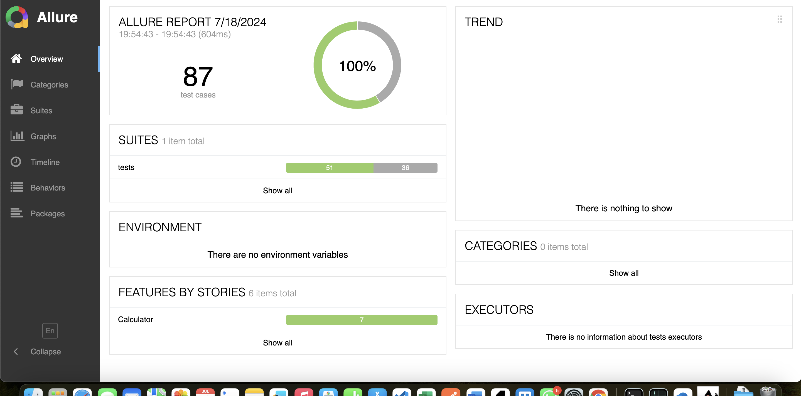

# Calculator Testing Project

This project is a simple calculator application with unit tests using `pytest` and HTML report generation with `Allure`. The calculator supports basic arithmetic operations like addition, subtraction, multiplication, division, exponentiation, root, and absolute value.

## Table of Contents

- [Calculator Testing Project](#calculator-testing-project)
  - [Table of Contents](#table-of-contents)
  - [Features](#features)
  - [Installation](#installation)
    - [Prerequisites](#prerequisites)
    - [Clone the Repository](#clone-the-repository)
    - [Create a Virtual Environment](#create-a-virtual-environment)
    - [Install Dependencies](#install-dependencies)
  - [Usage](#usage)
    - [Calculator](#calculator)
  - [Running Tests](#running-tests)
    - [Running Tests with Allure](#running-tests-with-allure)
  - [Generating Reports](#generating-reports)
  - [Allure Report Preview](#allure-report-preview)
  - [Contributing](#contributing)

## Features

- **Addition**: Add two integers.
- **Subtraction**: Subtract one integer from another.
- **Multiplication**: Multiply two integers.
- **Division**: Divide one integer by another (with error handling for division by zero).
- **Exponentiation**: Raise one integer to the power of another.
- **Root**: Calculate the n-th root of an integer.
- **Absolute**: Get the absolute value of an integer.

## Installation

### Prerequisites

- Python 3.x
- `pip` (Python package installer)

### Clone the Repository

```bash
git clone https://github.com/yourusername/calculator-testing.git
cd calculator-testing
```

### Create a Virtual Environment

It's recommended to create a virtual environment to manage dependencies.

```bash
python -m venv venv
source venv/bin/activate   # On Windows, use `venv\Scripts\activate`
```

### Install Dependencies

Install the required Python packages using `pip`.

```bash
pip install -r requirements.txt
```

If you don't have a `requirements.txt` file, you can create it with the following content:

```text
pytest
allure-pytest
```

## Usage

### Calculator

You can use the calculator by importing the `Calculator` class from the `src.calculator` module.

```python
from src.calculator import Calculator

calc = Calculator()
result = calc.add(2, 3)
print(result)  # Output: 5
```

## Running Tests

To run the tests, use the following command:

```bash
pytest
```

### Running Tests with Allure

To generate Allure reports, first run the tests with the `--alluredir` option to specify the directory where Allure will store the results.

```bash
pytest --alluredir=allure-results
```

## Generating Reports

To generate and view the Allure report, use the Allure command-line tool.

```bash
allure serve allure-results
```

Alternatively, you can generate the report and open it manually:

```bash
allure generate allure-results -o allure-report
allure open allure-report
```

## Allure Report Preview




## Contributing

Contributions are welcome! Please open an issue or submit a pull request with your changes.

# pytest-allure-calculator
